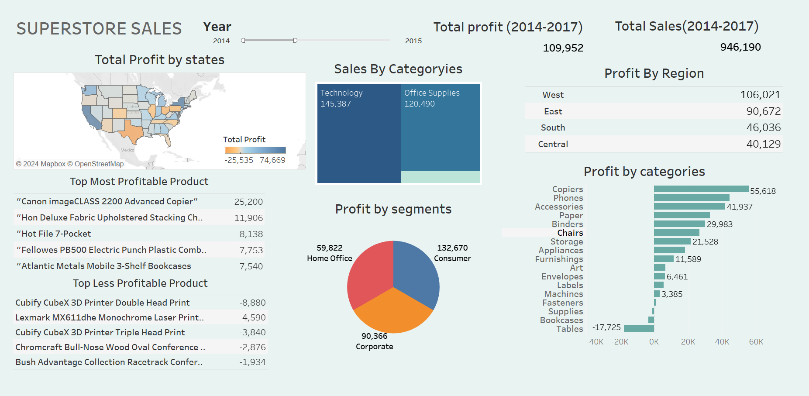

# Superstore_Sales_Data

# About Data
THe dataset was downloaded from Kaggle https://www.kaggle.com/datasets/vivek468/superstore-dataset-final. The dataset contains sales records from a superstore, including details on orders, shipping, customer demographics, and product categories. It includes columns such as Order ID, Ship Mode, Customer ID, Product Name, Sales, Profit, and Region. The data spans multiple years and provides insights into various aspects of the store's operations.

# Business Objective
1. Optimize Shipping Efficiency: Analyze shipping times across different modes to identify areas for improvement in delivery speed.
2. Enhance Profitability: Identify the most and least profitable products, categories, and customer segments to focus on high-margin items and improve low-performing areas.
3. Boost Sales: Examine sales trends by region, year, and quarter to develop targeted marketing strategies and sales forecasts.
4.Improve Customer Retention: Analyze customer demographics and buying patterns to understand customer behavior and improve retention strategies.
5. Maximize Discounts Effectiveness: Evaluate the impact of discounts on sales and profits to refine discounting strategies and promotional campaigns.

# Business question to answer
1. What is the average shipping time for each shipping mode?
2. What is the overall average shipping time across all orders?
3. Which 10 cities have the lowest total profit, and what are their corresponding sales and profit figures?
4. Which 10 states have the lowest total profit, and what are their corresponding sales and profit figures?
5. What are the total sales, total profit, and profit margins for each product category, ordered by total profit?
6. What is the total discount amount given for each product category?
7. How do different discount rates impact the average sales amount?
8. What are the total sales and total profit for each customer segment, ordered by total profit?
9. Which sub-categories have received the highest total discount amounts?
10. What are the total sales, total profit, and profit margin percentage for each region, ordered by profit margin percentage?
11. What are the total sales and total profit for each product category in each state?
12. What are the total sales and total profit for each region, ordered by total profit and total sales?
13. What are the total sales and total profit for each quarter of each year?
14. What are the total sales and total profit for each product category in each region?
15. What are the total sales, total profit, and profit margins for each sub-category, ordered by total profit?
16. Which 10 cities have the highest total sales, and what are their corresponding sales, profit, and profit margin percentages?
17. Which 10 states have the highest total profit, and what are their corresponding sales, profit, and profit margin percentages?
18. Who are the top 15 customers that generated the most sales, and what are their corresponding sales and profit figures?
19. Which subcategories in each state have the highest total sales and profits, and what are their corresponding sales and profit figures?
20. Which 15 products are the least profitable, and what are their corresponding sales and profit figures?
21. Which subcategories in each state have the lowest total sales and profits, and what are their corresponding sales and profit figures?
22. Which 15 products are the most profitable, and what are their corresponding sales and profit figures?
23. Which 15 states have the least number of unique customers?
24. Which 15 states have the most number of unique customers?
25. Which subcategories in each region have the highest total sales and profits, and what are their corresponding sales and profit figures?
26. Which subcategories in each region have the lowest total sales and profits, and what are their corresponding sales and profit figures?
27. Which categories in each state have the lowest total sales and profits, and what are their corresponding sales and profit figures?
28. What is the total number of unique customers in each region?
29. What is the total number of unique customers in the dataset?

# Code Example
What are the total sales, total profit, and profit margins for each product category, ordered by total profit? Check Superstor_queries file for all code
```sql
SELECT category, 
	SUM(sales) AS total_sales,
    SUM(profit) AS total_profit, 
    ROUND(SUM(profit)/SUM(sales)*100, 2) AS profit_margin
FROM superstore
GROUP BY 
	category
ORDER BY 
	total_profit DESC;
```

# Dashboard
The "Superstore Sales" dashboard provides a comprehensive overview of sales and profit data from 2014 to 2017. It features a map showing total profit by state, bar charts displaying sales by category and profit by region, and a pie chart illustrating profit distribution by customer segment. Additionally, the dashboard highlights the top five most and least profitable products, alongside a bar chart for profit by various product categories. This visualization aids in identifying key areas of profitability and areas needing improvement.

Link to Tableau Dashboard.[[Superstore_sales]] (https://public.tableau.com/app/profile/amit.pandit8190/viz/Superstore_Sales_17157222217720/Dashboard1?publish=yes)

# Observation
The analysis of the Superstore dataset reveals significant insights into sales and profitability trends. The West region is the most profitable, with technology and office supplies being the top-selling categories. While certain products like the Canon imageCLASS 2200 Advanced Copier generate high profits, others such as the Cubify CubeX 3D Printer lead to losses. The data suggests a need for strategic focus on high-margin products and regions, along with efforts to address underperforming products and regions to optimize overall profitability.